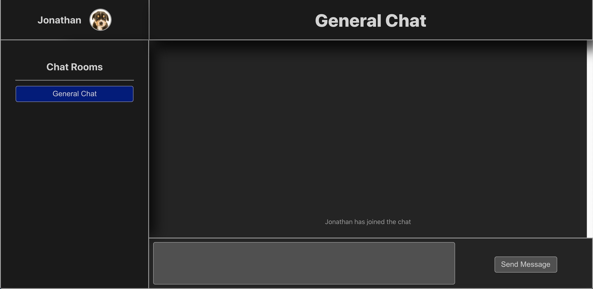

# Chattr (js)

A simple Chat App written in Javascript for NodeJS.

To get run this app locally, you'll need a working NodeJS development environment. You'll also need npm for easy JS dependency management.

This app is set to run on port 3000 by default.
